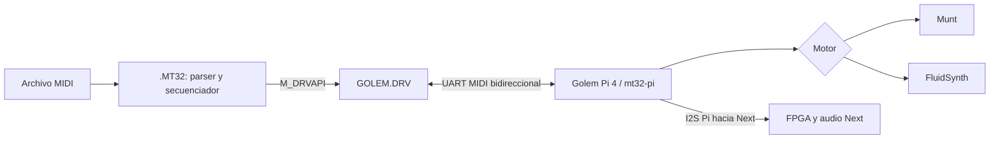

# Arquitectura de transporte de golem-next / Golem

Estado: diseño en implementación, actualizado 2026-10-03. Este documento
describe la base NextZXOS/UART/I2S ya implementada. La ampliación de producto y
la API genérica están en [golem-architecture.md](golem-architecture.md). El
hardware continúa sin validar.

## 1. Alcance y flujo

mt32-pi ejecutará bare metal en una Raspberry Pi 4 externa. El header
Accelerator del Next transportará UART y retorno I²S mediante GPIO estándar.
El módulo Golem v1 seleccionará Munt o FluidSynth mediante el SysEx versionado
del fork mt32-pi y recibirá su confirmación por el mismo UART. No se requiere
NextPi/Linux, servidor de red en la Pi, síntesis en el Z80 ni integración
específica con ningún juego.



## 2. Decisión: driver estándar con API propia

Fuente normativa consultada: [NextZXOS and esxDOS APIs, 24-05-2023, v2.08](https://gitlab.com/thesmog358/tbblue/-/raw/master/docs/nextzxos/NextZXOS_and_esxDOS_APIs.pdf), páginas 26, 35–36, 45 y 66; se estudian sus ejemplos como documentación, sin copiar código.

Resumen de restricciones oficiales: hasta cuatro drivers generales; imagen residente de 512 bytes relocatable y bancos adicionales opcionales. Hay entrada API e interrupción opcional. Canales/streams son una capacidad adicional del driver. La API se alcanza mediante M_DRVAPI, IDE_DRIVER o DRIVER de BASIC. M_DRVAPI ($92) recibe C=ID, B=función y HL/DE=parámetros; carry limpio indica éxito, carry activo error, A=0 driver ausente. Los buffers deben residir desde $4000. IDE_DRIVER invierte la convención de carry. El driver ejecuta con interrupciones deshabilitadas, preserva índices/alternativos y no puede usar hooks esxDOS ni restarts ordinarios.

| Opción | Valor para golem-next | Decisión |
| --- | --- | --- |
| Driver estándar + API propia | Contrato explícito de versión, errores, bloques binarios y recursos | Interfaz primaria. |
| Driver con streams | Conveniencia para clientes BASIC orientados a canales; exige definir apertura, cierre y semántica byte a byte | Extensión futura de la misma implementación. |
| Extensión/modificación del OS | Aumentaría mantenimiento y acoplamiento sin resolver una necesidad actual | No modificar NextZXOS; usar su punto de extensión existente. |

La elección es de diseño: la API permite representar escritura parcial, capacidad y fallo sin convertir MIDI en texto. El parser de archivos y el reloj son responsabilidad del cliente. Un stream futuro delegaría en el transporte existente, sin convertirse en otro secuenciador ni cambiar la ABI primaria. No confundir canales BASIC con streaming de disco.

## 3. Organización propuesta

La estructura se crea por incrementos, sólo cuando existe implementación o una
prueba concreta.

| Ruta prevista | Contenido / frontera |
| --- | --- |
| `src/driver/` | Entrada, despacho API, estado, instalación/relocación; genera GOLEM.DRV. |
| `src/transport/` | UART del Pi, configuración, FIFO y errores; enlazado en driver y diagnóstico. |
| `src/audio/` | Configuración/restauración del receptor I²S; no procesamiento PCM en Z80. |
| `src/dot/` | CLI, archivos, diagnóstico, cancelación y limpieza; genera comando MT32. |
| `src/midi/` | Parser SMF, estado por pista, merge y scheduler; propiedad de `.MT32`. |
| `include/` | ABI publicada, constantes y descripciones de estructuras. |
| `config/` | Perfiles documentados por versión de MT32-Pi y core; sin ROMs. |
| `tools/` | Generadores de fixtures originales y comparación de trazas. |
| `tests/unit/`, `tests/integration/`, `tests/hardware/` | Casos de parser, ABI/transporte y procedimientos físicos. |
| `tests/fixtures/` | MIDI sintético pequeño y expectativas de bytes/tiempos. |

Estado actual (#13, #76): el código de `.GOLEM` está en `src/dot/golem_cli.s`
(constantes, entrada, salida y errores) y en módulos incluidos desde
`src/dot/golem/`, en este orden: `cli.s`, `memory.s`, `reader.s`, `smf.s`, `scheduler.s`, `events.s`,
`golem_client.s`, `transport.s` y `data.s`. El orden de inclusión forma parte de
la disposición del binario. `src/midi/`, `src/transport/` y `src/audio/` todavía
no existen. La configuración I²S la hace el driver (`$A2`, #6). Las palabras clave se comparan con `match_word` contra la
tabla `kw_*`/`text_*` de `data.s`. `src/dot/golem.s`, `mt32.s` y `gm.s` sólo
fijan `CLI_ENGINE` (0, 1, 2) e incluyen `golem_cli.s`: `.MT32` y `.GM` piden el
motor a un Golem antes de `play` y `note` (`select_engine` en
`golem_client.s`).
| `docs/` | Contratos, cableado, decisiones y resultados medidos. |
| `dist/` | Paquete generado para SD, creado en M7. |

El arranque de M2 usa SNasm 3.4.0.0 incluido con NextBuild 10; el diagnóstico
usa ZX Basic 1.18.7-nb9 y el host, Python 3.13 incluido con NextBuild. CI y las
versiones mínimas soportadas se fijarán después de la prueba NextZXOS.

## 4. GOLEM.DRV y API experimental

El driver posee UART/audio mientras hay una sesión adquirida. `.MT32` adquiere al inicio y libera por una única ruta de salida. No habrá clientes simultáneos inicialmente. Conflictos con otras utilidades del Accelerator se documentarán: no existe arbitraje automático con programas que escriben los puertos directamente.

La ABI experimental 0.2 asigna provisionalmente funciones 0–6 y el ID de
desarrollo `$2D`; no son valores estables ni una reserva oficial. El contrato
exacto está en [driver-api.md](driver-api.md).

| Operación | Contrato propuesto |
| --- | --- |
| QUERY | Firma MT32-NEXT, versión mayor/menor, capacidades y límites; sin tocar hardware. |
| ACQUIRE | Rechazar uso concurrente; guardar estado accesible y aplicar perfil validado. |
| WRITE | Buffer y longitud; aceptar un prefijo acotado y devolver exactamente cuántos bytes se aceptaron. |
| STATUS | Estado local, capacidad TX y errores detectados; no equivale a presencia confirmada de la Pi. |
| DRAIN_STATUS | Consultar progreso del TX sin esperar dentro del driver. |
| RELEASE | Cerrar sesión/restaurar configuración posible y dejar estado definido. |
| READ | Consumir un prefijo RX ya disponible, con límite fijo y sin espera. |

WRITE no retiene punteros del cliente tras retornar. Si no hay capacidad devuelve cero progreso/ocupado; el cliente conserva el sufijo pendiente. Nunca reenvía el bloque entero después de una escritura parcial. Buffers en memoria visible durante la llamada; comprobar longitud, final y cruces de bancos antes de aceptarlos. En `M_DRVAPI`, los comandos punto proporcionan ese puntero mediante `HL`, mientras que los programas estándar/NEX lo proporcionan mediante `IX`; NextZXOS normaliza ambos y el driver lo recibe en `HL`.

La tabla oficial [DriverIDs.txt](https://gitlab.com/thesmog358/tbblue/-/blob/master/docs/nextzxos/DriverIDs.txt)
no contiene todavía una clase MIDI y pide solicitar nuevos IDs a su mantenedor.
Por eso QUERY devuelve la firma `MT`, que permite distinguir una colisión durante
el desarrollo, y el ID no se congelará hasta realizar esa coordinación.

Sin IM1 propio ni cola de secuenciación en la primera versión. Usar capacidad TX disponible, límite fijo por llamada y retorno inmediato; nunca esperar a que termine un SysEx. En CSpect, 32 muestras por ruta a 3,5/7/14/28 MHz y 50/60 Hz acotaron `WRITE` de 16 bytes; el peor límite observado por velocidad fue <1,603/0,834/0,513/0,321 ms y, con FIFO llena, <1,154/0,385/0,193/0,193 ms. Repetir en hardware. El cliente realiza timeouts y reintentos. No confundir FIFO vacía con último bit ya transmitido: verificarlo para el core elegido antes de desconectar/restaurar UART.

Presupuesto inicial: intentar mantener entrada y estado mínimos en el residente; medir el tamaño real. Si no cabe, asignar banco explícitamente y documentar coste, sin suponer que toda la implementación cabrá. Cualquier cambio de MMU debe revertirse. Configuración no legible/restaurable requiere política explícita y estado final documentado.

## 5. UART Next ↔ Pi

Protocolo musical: bytes MIDI estándar, sin cabecera de golem-next ni RPC
añadido. Para administración, el fork Golem de mt32-pi añade un SysEx `$7D`
versionado con transacción y respuestas `ACCEPTED/READY/ERROR/STATUS`, descrito
en [mt32-pi-control.md](mt32-pi-control.md). El driver sólo mueve esos bytes en
ambos sentidos; no reconoce el protocolo ni convierte FIFO vacía en ACK.

Perfil inicial a probar: 31250 baud, 8N1, sin RTS/CTS. En este perfil cada byte ocupa diez bits, unos 320 microsegundos: el máximo teórico es 3125 bytes/s. El secuenciador debe reconocer la saturación y reportar retrasos; no descartar bytes silenciosamente. Velocidades superiores requerirán perfil coincidente y mediciones.

Según [ports.txt oficial](https://gitlab.com/SpectrumNext/ZX_Spectrum_Next_FPGA/-/raw/master/cores/zxnext/ports.txt), los UART comparten puertos: $153B selecciona Pi con bit 6, $133B transmite/consulta estado, $143B recibe/configura divisor y $163B configura trama. El divisor depende del reloj de sistema, no simplemente del turbo Z80. La revisión consultada describe FIFO TX de 64 bytes y RX de 512: contrastar con el core instalado.

El transporte preservará selección previa cuando corresponda y no configurará
el UART ESP por accidente. RX es opcional para música y obligatorio sólo para
operaciones administrativas confirmadas. Los SysEx conservarán orden y límites;
la fragmentación interna del buffer no añade F0/F7 artificiales.

## 6. Cable externo y retorno I²S

**Aislar 5V y 3V3 en todos los conductores entre ambas placas; alimentar Next y Pi por separado y unir GND.** No usar las alimentaciones del Accelerator para la Pi externa. Una señal GPIO de 3,3 V es distinta de la línea de alimentación 3V3 que se deja desconectada.

Mapa lógico propuesto, con números físicos exclusivamente del conector estándar de 40 pines de la Pi; **no trasladarlos a la posición física del Next sin verificar su esquema/orientación**:

| Señal | Pi BCM / pin físico | Dirección propuesta |
| --- | --- | --- |
| UART RX de Pi | GPIO15 / 10 | Next TX → Pi RX |
| UART TX de Pi, opcional | GPIO14 / 8 | Pi TX → Next RX |
| PCM_CLK / BCLK | GPIO18 / 12 | Pi → Next |
| PCM_FS / LRCLK | GPIO19 / 35 | Pi → Next |
| PCM_DOUT | GPIO21 / 40 | Pi → Next, audio |
| PCM_DIN | GPIO20 / 38 | Sin conectar en esta propuesta unidireccional |
| Masa | GND, por ejemplo pin 6 | Común |
| Alimentación 5V | Pines 2 y 4 | Aislados, no conectar |
| Alimentación 3V3 | Pines 1 y 17 | Aislados, no conectar |

Referencias: [hardware Raspberry Pi](https://www.raspberrypi.com/documentation/computers/raspberry-pi.html), [entrada GPIO MIDI de MT32-Pi](https://github.com/dwhinham/mt32-pi/wiki/GPIO-MIDI-interface). UART/I²S son funciones estándar del GPIO, no señales exclusivas de una Pi Zero. Esto no demuestra compatibilidad eléctrica/temporal de cualquier modelo con el Next.

Antes de alimentar: identificar pin 1 y ambas caras de conectores; medir continuidad señal a señal, GND común y ausencia de conexión entre raíles. Usar cable corto y comprobar integridad; documentar su longitud. No conectar en caliente ni dejar señales activas hacia una placa apagada sin estudiar protección contra alimentación parásita. No es un enlace RS-232 ni una entrada MIDI DIN directa.

El [listado oficial de registros](https://gitlab.com/SpectrumNext/ZX_Spectrum_Next_FPGA/-/raw/master/cores/zxnext/nextreg.txt) define $A0 bit 5 para UART y bit 4=1 para comunicación con Pi. En $A2, bits 7:6=11 seleccionan estéreo y bit 4=1 recibe PCM_DOUT de la Pi. Deben respetarse bits reservados de la revisión objetivo, incluidos los cambios históricos relativos al reloj. No fijar un literal de registro sin verificar el core.

Decisión (#6): `ACQUIRE` del driver guarda NextReg `$A2`, escribe `$D2` y `RELEASE` lo restaura. `$D2` es el valor validado en hardware con mt32-pi el 2026-10-05 (bits 7:6 y 4 como arriba; el bit 1 queda tal como se validó y está pendiente de contrastar con el `nextreg.txt` del core instalado).

Configuración candidata para **fusionar con el archivo de la versión instalada**, no reemplazo completo:

```ini
[midi]
gpio_baud_rate = 31250
gpio_thru = off

[audio]
output_device = i2s
sample_rate = 48000
```

Las opciones se contrastaron con [mt32-pi.cfg](https://github.com/dwhinham/mt32-pi/blob/main/sdcard/mt32-pi.cfg) y [salida I²S](https://github.com/dwhinham/mt32-pi/wiki/I%C2%B2S-DACs). Seleccionar síntesis MT-32 y entrada GPIO en la versión instalada, evitando que un dispositivo USB cambie la entrada. Mantener los restantes ajustes del perfil upstream hasta medir.

Hipótesis M1: Pi proporciona reloj y datos; Next recibe y mezcla. Medir frecuencia BCLK/LRCLK, anchura de palabra/slot, polaridad/alineación y canales; 48 kHz es un punto de partida, no una combinación validada. El Next no envía audio a la Pi ni requiere DAC externo para este retorno. Registrar latencia y distorsión. Si falla, mantener M1 abierto y revisar configuración antes de avanzar.

## 7. `.MT32` y reproductor

El comando coordina archivos, memoria, UI, reloj, transporte y salida limpia. Separar lector SMF de scheduler mediante eventos normalizados: tiempo absoluto, pista, orden original, tipo, longitud y datos o referencia a payload. El driver sólo ve bytes MIDI preparados.

Diseño inicial para [SMF](https://midi.org/standard-midi-files-specification):

- Validar MThd/MTrk, tamaños, límites de archivo y VLQ. Soportar formatos 0/1 con PPQN positivo. Rechazar SMF 2 y SMPTE con error claro.
- Tiempo inicial 500000 microsegundos por negra; cambios de tempo desde eventos de tempo. Conservar resto en `delta_ticks * tempo / PPQN`, con aritmética suficientemente ancha y detección de overflow.
- Cursor, tick absoluto y running status independientes por pista. Ordenar por tick y desempatar por índice de pista y orden del archivo. Cambios de tempo afectan al intervalo siguiente; documentar cómo se resuelven varios en el mismo tick.
- Restaurar status explícito al producir cada mensaje de canal para que la fusión de pistas no mezcle estados implícitos. Aplicar las reglas SMF de cancelación de running status en meta/SysEx y probarlas.
- Note On/Off, presión, Control Change, Program Change y Pitch Bend; longitudes exactas. No enviar metaeventos ni bytes estructurales SMF al cable.
- Distinguir F0, continuación F7 y escape F7 de SMF; conservar el payload y evitar introducir delimitadores que no existen. Mantener estado de SysEx abierto y detectar truncamientos.

La primera estrategia de memoria será cargar un archivo que quepa en bancos asignados y recorrerlo por cursores de pista, evitando lectura SD en el instante de cada evento. M4 debe medir y publicar tamaño máximo, número de pistas y uso de RAM. Archivos excesivos se rechazan antes de reproducir. Streaming de archivos mayores sería posterior, con prelectura y mediciones específicas.

La primera implementación asignaba cuatro bancos de 8 KiB para el archivo y lo
mapeaba entero en `$8000-$FFFF`, con un límite de 32767 bytes. Desde el 5 de
octubre de 2026 (#14) el archivo se lee entero en tantos bancos de 8 KiB como
necesite, pedidos de uno en uno a `IDE_BANK` (hasta 128: 1048575 bytes). Las
posiciones del archivo son de 24 bits y `src/dot/golem/reader.s` lee byte a byte:
el banco que contiene la posición se mapea en el MMU 7 (`$E000-$FFFF`) sólo
cuando cambia. Al empezar cada evento, y tras cada llamada al driver, se vuelve
a mapear, porque una llamada al sistema puede haber cambiado el MMU 7. Así no se
lee la SD durante la reproducción, a costa de memoria y de tiempo de carga: un MIDI de 646 KB ocupa
79 bancos, más el de trabajo. Si faltan bancos, `play` falla con «faltan bancos de memoria» y
libera los que ya tenía. Se conservan y restauran los MMU 4–7 y se admiten 24
pistas.

Desde #57, `play` corre entero a 28 MHz (carga incluida) y la salida común
restaura la velocidad del llamador. A 3,5 MHz el lector byte a byte y las
llamadas de 16 bytes al driver no daban para tener el UART ocupado: la
introducción de KQ5 (73 SysEx, 18584 bytes) salía a unos 2500 bytes/s en vez de
3125. Además, el tiempo que el scheduler pasa esperando al UART (contado en
líneas raster en `elapsed_lines`) era de 16 bits y se saturaba a los 4,2 s, y
pagar esa deuda línea a línea iba más lento que el tiempo real a 3,5 MHz. Ahora
el contador es de 24 bits y la validación de un SysEx largo cuenta líneas cada
16 bytes, para que ningún cuadro entero pase sin verse. En el Next, la primera
nota de KQ5 sonaba 14,6 s después de cargar en lugar de 7,2. En el arnés con un
UART limitado a 3125 bytes/s, 73 SysEx de 254 bytes en el tick 0 y una nota a
los 7,2 s: la nota salía a los 9,0 s antes de #14, a los 10,2 s con #14 y
ahora a los 7,26 s, igual que sin SysEx. El

comando se carga por debajo de `$4000`. Desde el 4 de octubre de 2026 (#2), todos
los subcomandos reservan además un banco de trabajo propio y lo mapean en el
MMU 3 mientras se ejecutan. En él están el buffer de E/S visible en `$6000` y la
pila local en `$7FF0`. Antes ambos estaban en el banco 5, donde NextZXOS guarda
el programa BASIC y sus variables, que quedaban corrompidos. La línea de comandos
se analiza antes de mapear el banco, porque también puede estar en
`$6000-$7FFF`. Al salir se vuelve a la pila del llamador antes de restaurar el
MMU 3 y liberar el banco. Estos límites se comprueban antes de adquirir el
driver.

El scheduler acumula microsegundos con resto exacto y observa los NextRegs
`$1E/$1F`, contador raster de sólo lectura. Lee NextReg `$05` al inicio y
selecciona 50 o 60 Hz sin depender del manejador de interrupciones ni ocupar un
CTC. La unidad musical es 1 ms: a 50 Hz reparte las 312 líneas de cada cuadro
entre veinte pasos de 15/16 líneas; a 60 Hz reparte 786 líneas de tres cuadros
entre cincuenta pasos de 15/16 líneas. Ambas secuencias suman exactamente su
periodo y no acumulan deriva entera. El modo queda fijado al iniciar la
reproducción; no se admite cambiar 50/60 Hz durante una canción. Preservar los
eventos incluso al llegar tarde, contar retrasos y permitir cancelar; no
comprimir automáticamente pausas de SysEx.

La primera versión cuantizaba al cuadro completo. En `MI_1.MID`, 1129 de 1546
intervalos positivos entre notas menores de 20 ms colapsaban al mismo instante
y la escucha reveló fluctuaciones. Un prototipo posterior intentó atender cada
línea (~64 µs), pero a 3,5 MHz su propia contabilidad superaba ese presupuesto y
`TESTTIM.MID` se ejecutó aproximadamente 5,38 veces más lento. Ambos diseños se
descartaron. El paso de 1 ms conserva la resolución útil sin exigir una vuelta
completa del scheduler por línea.

Como referencia software, `TESTTIM.MID` fija eventos a 0,0, 0,5, 0,9 y 1,9 s e
incluye cambios 500000→400000→500000 µs por negra. La matriz del paso de 1 ms
pasó a 3,5/7/14/28 MHz tanto a 50 como a 60 Hz con tolerancia ±50 ms. A 50 Hz
el error absoluto máximo observado fue 4 ms. A 60 Hz/3,5 MHz la llegada TCP
mostró hasta 26 ms y separó mensajes del mismo tick; las repeticiones confirmaron
que es un límite reproducible de este banco, que incluye planificación de
CSpect, plugin, TCP y Windows. No se atribuye esa cifra al UART ni se presenta
como jitter físico: M4 exige captura sobre la línea real.

Se evaluó usar el CTC del Next como reloj fino: su base es independiente del
turbo, pero el core actual sólo expone cuatro canales, el canal 3 puede alimentar
el reloj del joystick y la configuración de un canal no se puede leer para
restaurarla. No se ocupará un CTC sin una reserva explícita. El prototipo raster
50/60 Hz evita esa colisión y queda como implementación actual.

`.MT32 play` es un reproductor de validación en primer plano y puede ocupar el
proceso durante toda la canción. No es la interfaz concurrente destinada a un
juego. Antes de congelar M6 se extraerá un secuenciador cooperativo: una llamada
`pump/update` con presupuesto acotado procesará sólo los eventos vencidos y
devolverá inmediatamente el control. El driver seguirá limitado al transporte
no bloqueante y no adquirirá parser, reloj ni cola autónoma.

En fin/cancelación/error: resolver cualquier mensaje parcial según política documentada, enviar limpieza MIDI cuando sea posible, esperar fuera del driver con timeout, cerrar archivos, liberar bancos y sesión, restaurar estado y devolver error útil. Probar salida durante SysEx y fallo de transporte: la limpieza es de mejor esfuerzo si no puede transmitirse.

## 8. Fixtures, dumps y tests

Utilidades propias producirán MIDI sintético y un oráculo legible de bytes y tiempos esperados. No copiar parser ni código de otros proyectos. Guardar fixtures pequeños en el repositorio; dumps comerciales, ROMs y capturas privadas quedan fuera.

| Nivel | Casos / evidencia |
| --- | --- |
| Parser | SMF0 mínimo; SMF1 con eventos simultáneos; tempo variable; running status por pista; F0/F7 segmentados; meta desconocido; End of Track. |
| Negativos | Cabecera/chunk truncado, longitud fuera de archivo, VLQ inválido, status ausente, división cero/SMPTE, formato no soportado, exceso de pistas/memoria. |
| Scheduler | Reloj simulado, cambios de tempo, resto fraccionario, empates, overflow, eventos densos, atraso y cancelación. |
| Transporte/API | FIFO llena, cero progreso, aceptación parcial y orden exacto; ID ocupado/ausente; versión incompatible; preservación de registros/MMU y liberación. |
| Hardware | UART capturado, audio estéreo, arranque frío, ausencia de Pi, SysEx largo y medición de jitter con versiones fijadas. |

El procedimiento físico reproducible, la topología de sondas, el importador de
CSV y la plantilla de evidencia están en
[`tests/hardware/README.md`](../tests/hardware/README.md). El analizador lógico
se conecta en paralelo y el PC queda fuera del camino funcional Next↔Golem.

Comparar salidas con expectativas escritas a mano para los casos mínimos, además de cualquier generador, para no validar el parser contra sí mismo. Un emulador sin UART/I²S de Pi no certifica la ruta física.

El material local de Monkey Island ya está identificado: `MI_1.MID` es un SMF1
MT-32 de 17 pistas y su ficha Quest Studios indica que utiliza los timbres de
fábrica, sin banco de patches. La colección distingue la serie `MI_*.MID` para
MT-32 de las conversiones General MIDI; `MIGM1.TXT` lo confirma expresamente
para el tema de apertura. Por ello, ausencia de SysEx en `MI_1.MID` es correcta
y M5 debe evaluar programas/timbres de fábrica, reproducción completa y final
limpio, no exigir una carga de patches inexistente. `.SYX` sigue describiendo
mensajes sin tiempos de canción y una captura cruda necesitaría marcas
temporales; no forzar `.MT32 play` a adivinar esos formatos.

## 9. Estado de implementación

El diagnóstico software, `GOLEM.DRV`, `.MT32` y `.GOLEM` existen. El driver se
instala y su ABI se ejercita con clientes separados bajo NextZXOS en CSpect. El
reproductor ha ejecutado fixtures SMF0/1 y archivos reales; SysEx F0/F7,
cancelación con limpieza, casos SMF negativos e informes de error están
validados. La duración de llamada y la preservación de estado están medidas en
CSpect, y el reloj raster de 1 ms cumple en 3,5/7/14/28 MHz y 50/60 Hz.

El 2026-10-05 el sistema sonó por primera vez en hardware real con una Pi 3:
UART, I²S y la mezcla del Next funcionan. M1 sigue abierto hasta tener capturas
de reloj y datos y mediciones; M4 necesita además la comparación temporal y el
jitter en hardware. Las secciones siguientes describen el diseño y el historial
del banco.

## 10. Banco de integración software con CSpect y Munt

CSpect se utilizará como banco de integración previo y complementario a las pruebas físicas. El objetivo es ejecutar el mismo `GOLEM.DRV` y los mismos clientes NextZXOS que se usarán en el Next, observar el UART del Accelerator y entregar los bytes MIDI a Munt en el host. Este banco no modifica la arquitectura de producción ni introduce un protocolo nuevo en la Pi.

```text
.MT32 / cliente de prueba en NextZXOS
              ↓ M_DRVAPI
           GOLEM.DRV
              ↓ UART Pi emulado por CSpect
      plugin MT32NextUartBridge
              ↓ TCP local 127.0.0.1:15320
 captura exacta / puente WinMM–MIDI
              ↓ MIDI de Windows o libmt32emu
             Munt
              ↓
        audio del equipo anfitrión
```

La prueba inicial descartó el camino de puerto COM virtual. Se implementó un
plugin CSpect propio que posee los puertos UART Pi y expone un stream TCP local
bidireccional. Esto evita instalar un controlador de kernel antiguo y conserva
los 8 bits de MIDI y SysEx. Sólo un plugin debe poseer esos puertos; el
`UARTReplacement.dll` oficial se deshabilita mientras se usa este banco.

El host ofrece dos receptores: captura binaria con comparación automática y un
puente WinMM hacia Munt. El parser soporta mensajes de canal, running status,
System Common/Realtime y SysEx sin introducir delimitadores. La reproducción
audible sigue siendo evidencia auxiliar; la traza binaria es el oráculo.
El puente admite `--sysex pass|drop` para comparar la misma secuencia con y sin
System Exclusive sin modificar el driver, el scheduler ni los eventos de canal.

Este banco permite probar instalación y ABI, selección del UART Pi, escrituras parciales, orden exacto de bytes, saturación simulada, parser y scheduler SMF, SysEx, cancelación y limpieza. No certifica pinout, niveles eléctricos, cableado, ritmo físico efectivo a 31250 baud, comportamiento temporal del FPGA real, BCLK/LRCLK/datos I²S, mezcla del Next, latencia de audio ni jitter físico. Por tanto, nunca cierra M1 ni sustituye sus capturas de hardware.

El 2026-10-01, con CSpect 3.1.4.0 y Munt, el diagnóstico produjo exactamente
`91 3C 64 81 3C 00` y audio audible. Después, NextZXOS instaló el driver y el
cliente `MTTEST` repitió la traza mediante `M_DRVAPI`; un marcador `F8` posterior
a `.uninstall` confirmó que la secuencia continuó. La presión determinista del
plugin validó escritura parcial y cero progreso sin alterar el orden. Las
pruebas con clientes separados cubrieron ausencia, ID ocupado y errores de API.
Las matrices de duración/estado del driver y `.MT32 note`/`status` están
cubiertas en CSpect; sigue pendiente validar físicamente la fuente temporal.
El primer fixture evitó `PAUSE`, que en un NEX entraba en ROM y bloqueaba la
prueba; usa cruces de raster para avanzar 25 frames.

El mismo día, `.MT32 play TEST1.MID` fusionó dos pistas y produjo exactamente
`C1 00 91 40 64 91 40 00`, seguido de All Notes Off en los 16 canales. Después
reprodujo por Munt `MI_1.MID` (SMF1, 17 pistas, 29608 bytes) sin incorporar el
archivo comercial al repositorio. Su ficha lo identifica como versión MT-32
basada en timbres de fábrica y sin patch bank; los cero SysEx del inventario son
por tanto esperados. La escucha confirma la ruta funcional; no sustituye la
comparación temporal ni la prueba física.

También se capturó exactamente un SysEx de display dividido entre eventos SMF
F0/F7, sin filtrar longitudes ni deltas al cable. Para cancelación se mantuvo
activo un acorde de órgano de tres notas durante 10 segundos: SPACE produjo
directamente All Notes Off en los 16 canales, antes de los Note Off previstos,
y Munt cortó el sonido de forma inmediata.

El 2026-10-02, `TESTSAB.MID` proporcionó un control audible: dos notas de órgano
idénticas y un DT1 Roland que cambia temporalmente `Key Shift`; con el filtro
SysEx ambas sonaron iguales y con transmisión la segunda subió una octava. Como
caso real adicional, un soundtrack local de King’s Quest V contenía 165 DT1 con
checksums válidos. Un extracto local de 30 s, dentro del límite inicial de
memoria, conservó 74 SysEx y produjo una diferencia instrumental inequívoca
frente a la misma reproducción filtrada. El original de 646786 bytes exige
streaming para reproducirse entero y no se incorpora al repositorio.

La suite negativa rechaza formato 2, división SMPTE, longitud de pista truncada
y VLQ de cinco bytes antes de adquirir el driver. Un `TEST0.MID` posterior
produce la única traza de la suite, lo que demuestra retorno y ausencia de
contaminación del transporte. Si un F0 queda abierto durante la reproducción,
la salida de error emite F7 antes de All Notes Off; el caso se valida con
`BADSYX.MID` y una comparación exacta de bytes.
